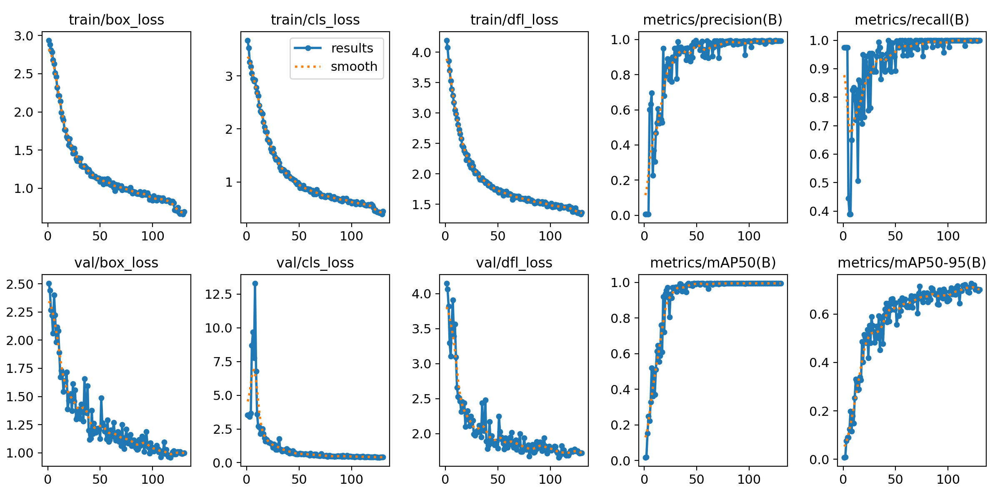
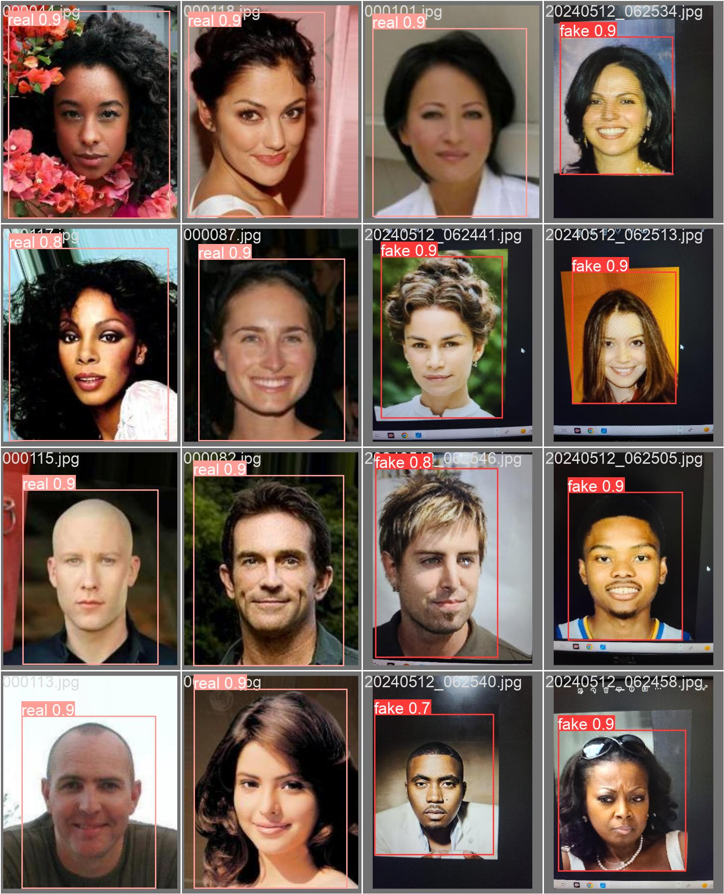

# Liveness_antispoofing_detector

## 

## 

### Made an analysis using the validation batch which had a list of pictures which where both real and fake. And the model was predicting quite accuratetly with an accuracy of above 90%